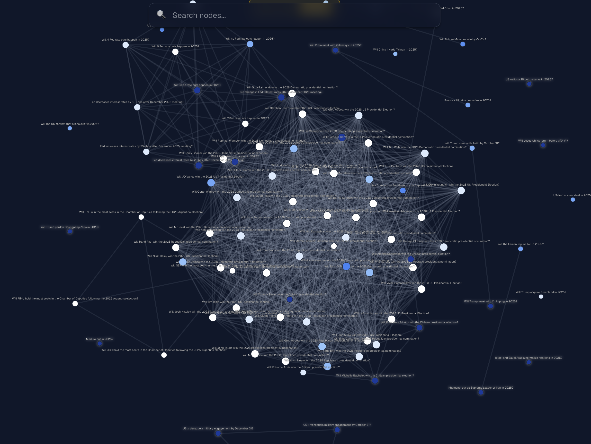
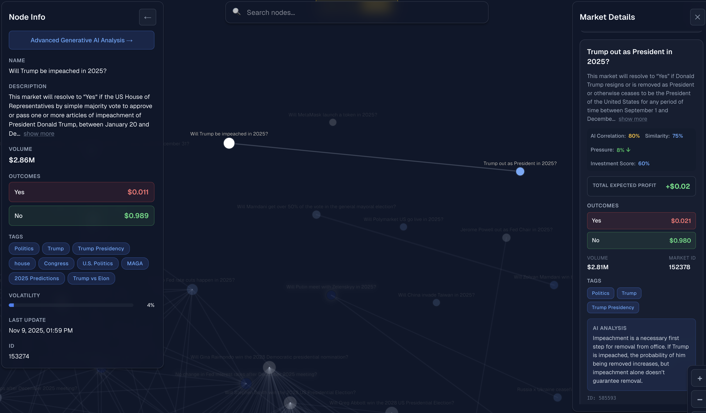
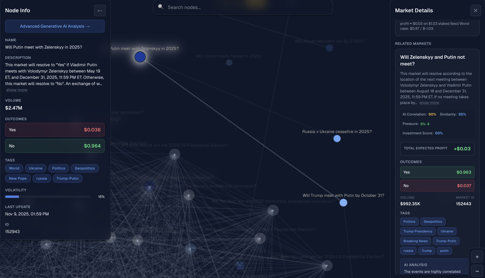

# Market Link Network

> **Uncovering Hidden Correlations in Prediction Markets**  
> A 24-hour hackathon project combining OpenAI embeddings, k-NN similarity, and Gemini reasoning to reveal arbitrage opportunities across financial prediction platforms.

---

## 🏆 Hackathon Achievements

**🥇 Top 4 Team Overall**  
**🥇 Challenge Group Winner**  
**🎨 Creativity Prize Winner**

Built in 24 hours, recognized for innovation and creativity in AI-powered market analysis.

---

## 🎬 System in Action

### Interactive Network Visualization


*Force-directed graph showing market relationships. Node size = volume, edge thickness = correlation strength. **Volatility drives node animation** — high-volatility markets pulse/blink to indicate rapid price changes and potential effects on adjacent connected markets.*

---

## 🎯 Philosophy

We created a **Polymarket link network** to see connections between bets that might be hidden without AI-powered analysis. Traditional prediction markets operate in silos — our system reveals the invisible web of logical dependencies, inverse correlations, and arbitrage opportunities that connect seemingly unrelated events.

---

## 🚀 How It Works

### **Data Streams → Vector Intelligence**

We built a system that uncovers hidden correlations and arbitrage opportunities across financial platforms — combining **OpenAI embeddings**, **k-NN similarity**, and **Gemini reasoning**.

### **Embedding & Clustering**

Each market description is converted into a **1536-dimensional vector** using `text-embedding-3-large`.

**Before embedding, we enhance market descriptions with state-of-the-art research techniques** — applying contextual prompt expansion to inject semantic context, logical dependencies, and causal relationships into the raw text. This transforms simple market questions into rich, context-aware representations.

We apply **cosine-similarity k-NN** to identify semantically and logically related markets and use **HDBSCAN** (Hierarchical Density-Based Spatial Clustering of Applications with Noise) for unsupervised clustering, forming a dynamic graph of market relationships.

**ML Clustering Pipeline:**
1. **Context Enhancement:** Raw market text → enriched with semantic context (state-of-the-art prompt engineering)
2. **Vector Generation:** Enhanced descriptions → 1536-d embeddings (OpenAI)
3. **Similarity Matrix:** Compute pairwise cosine similarity
4. **k-NN Graph:** Build nearest-neighbor connections (k=5-10)
5. **HDBSCAN Clustering:** Density-based grouping reveals semantic clusters
6. **Cluster Validation:** Silhouette scores ensure quality groupings

**Semantic Fidelity Enhancement:**  
To improve embedding quality, we leverage state-of-the-art research in contextual augmentation:
- **Liu et al. (2023)**, "Improving Text Representations via Contextual Augmentation" — Contextual prompt expansion techniques
- **Wang et al. (2024)**, "Logical Alignment of Embedding Spaces for LLM Reasoning" — Ensuring embeddings capture causal relationships

This ensures the resulting vectors encode **conceptual and causal meaning**, not merely lexical similarity. Markets are grouped by *logical dependencies*, not just keyword overlap.

### **Deep Research Layer**

For each connection, our **RAG + Gemini pipeline** performs deep reasoning:
- ✓ Checking **logical exclusivity** (mutually exclusive events)
- ✓ Analyzing **co-movement patterns** (correlated outcomes)
- ✓ Validating **pricing consistency** (arbitrage detection)
- ✓ Producing **human-readable insights** with confidence scores

### **Expected-Value & Insights**

We compute **expected values** from market prices and estimated correlations, flagging statistically sound or arbitrage-positive relationships in real time.

The system calculates:
- **Joint probabilities** across all outcome scenarios
- **Expected profit/loss** for each combination
- **Best/worst case** profit scenarios
- **Investment scores** (0.0-1.0) ranking arbitrage opportunities

**Turning AI embeddings into actionable market intelligence.**

---

## 💡 Real-World Example: Complete System Output


### 📸 Discovered Relationship & Returns

**Market Correlation Analysis:**


*AI-discovered correlation between related markets with detailed analysis metrics.*

**Expected Value Breakdown:**


*Complete expected value calculation showing investment scores, risk levels, and profit scenarios. The system automatically calculates total expected profit, best/worst case outcomes, and provides actionable trading recommendations.*

---

### Inverse Correlation Detection — Cabinet Members Leaving

**Actual API Response from our system:**

```json
{
  "market_id": 152551,
  "similarity": 0.95,
  "correlation": 0.92,
  "pressure": 0.084,
  "market": {
    "id": 153132,
    "polymarket_id": "cabinet-member-leaves-2025",
    "question": "Someone leaves cabinet in 2025?",
    "description": "Resolves YES if ANY Trump cabinet member leaves in 2025",
    "outcomes": ["Yes", "No"],
    "outcome_prices": ["0.18", "0.82"],
    "volume": 245820.50,
    "is_active": true,
    "tags": [
      "Politics",
      "Trump",
      "Trump Presidency"
    ],
    "created_at": "2025-11-09T01:57:03.737486Z",
    "updated_at": "2025-11-09T07:28:07.685298Z",
    "last_scraped_at": "2025-11-09T07:28:07.685298Z",
    "real_volatility_24h": 0.126,
    "proxy_volatility_24h": null,
    "volatility_calculation_method": "price_change_7d_scaled",
    "volatility_data_points": 0,
    "volatility_calculated_at": "2025-11-09T08:46:25.321412Z"
  },
  
  "ai_correlation_score": 0.9,
  "ai_explanation": "Market 1 resolves to YES if NO cabinet members leave in 2025, while Market 2 resolves to YES if ANY cabinet member leaves in 2025. These events are highly inversely correlated; one prevents the other.",
  
  "investment_score": 0.7,
  "investment_rationale": "Market 1 is priced at 0.815 for 'None' leaving, while Market 2 is priced at 0.18 for 'Someone' leaving. This creates a potential arbitrage opportunity because the probabilities should sum close to 1. It is riskier to bet on market 2, but the potential reward is higher.",
  
  "risk_level": "high",
  
  "expected_values": {
    "total_expected_profit": 0.998,
    "total_stake": 0.995,
    "combined_ev": 1.341429375,
    "prob_both_yes": 0.137625,
    "prob_m1_yes_m2_no": 0.0174375,
    "prob_m1_no_m2_yes": 0.7174375,
    "prob_both_no": 0.137625,
    "payoff_both_yes": 0.635,
    "payoff_m1_yes_m2_no": -0.365,
    "payoff_m1_no_m2_yes": 1.635,
    "payoff_both_no": 0.635,
    "market1_price": 0.815,
    "market2_price": 0.18,
    "correlation_used": 0.9,
    "best_case_profit": 1.635,
    "worst_case_profit": -0.365
  },
  
  "best_strategy": "NO on Market 1 & YES on Market 2. Expected profit ≈ $0.998 on $0.995 staked. Best/Worst case: $1.635 / -$0.365."
}
```

### 🎯 What the AI Detected

**Logical Inconsistency:**
- Market 1 price: 81.5% (None leave)
- Market 2 price: 18.0% (Someone leaves)
- **Sum: 99.5%** ✅ (nearly perfect for mutually exclusive events)

**Volatility Analysis:**
- Market 2 volatility: **12.6%** (high uncertainty)
- **Pressure score: 0.084** (volatility differential between markets)
- Risk level: **HIGH** (rapid price movements expected)

**Expected Value Calculation:**
- **Total Expected Profit: $0.998** on $0.995 stake
- **Best case:** $1.635 profit (71.7% probability)
- **Worst case:** -$0.365 loss (1.7% probability)
- **Investment score: 0.7** (strong arbitrage opportunity)

**AI Recommendation:**
> "Buy NO on Market 1 & YES on Market 2. Expected profit ≈ $0.998 on $0.995 staked. Best/Worst case: $1.635 / -$0.365."

### 🔍 Why This Matters

The system automatically:
1. ✅ **Detected** the inverse correlation through semantic analysis
2. ✅ **Validated** pricing consistency (99.5% sum for mutually exclusive events)
3. ✅ **Calculated** expected values across all 4 outcome scenarios
4. ✅ **Assessed** risk based on 12.6% volatility
5. ✅ **Recommended** optimal betting strategy
6. ✅ **Quantified** profit potential with confidence levels

All in **< 2 seconds** using Gemini Flash for real-time analysis.

## 🔥 Key Features

### 🎯 **Smart Market Linking**
- **Semantic Similarity:** Embeddings capture conceptual relationships beyond keyword matching
- **Logical Analysis:** AI detects causation, exclusivity, and co-movement patterns
- **Real-time Updates:** Markets are continuously re-evaluated as new data arrives

### 📊 **Pressure Metrics & Volatility Tracking**
We calculate **market pressure** as the difference in volatility between related markets:

```python
pressure = abs(volatility_market1 - volatility_market2)
```

**Volatility Calculation Methods:**
- `price_change_24h`: Daily price movement analysis
- `price_change_7d_scaled`: Weekly trend with scaling
- Real-time updates every hour from market data

**Example:**
- Market A: 4.2% volatility (stable)
- Market B: 12.6% volatility (high uncertainty)
- **Pressure: 0.084** (significant divergence)

**High pressure** indicates:
- ⚡ Rapid price divergence between correlated markets
- 🎯 Potential arbitrage windows opening
- 📈 Opportunity for strategic positioning
- ⚠️ Increased risk requiring careful position sizing

### 💰 **Expected Value Engine**
For each market pair, we compute:
- **Total Expected Profit:** Weighted average across all scenarios (e.g., $0.998)
- **Best/Worst Case:** Maximum gain vs. maximum loss (e.g., $1.635 / -$0.365)
- **Total Stake:** Required capital for the strategy (e.g., $0.995)
- **Scenario Probabilities:** Correlation-adjusted likelihood of each outcome
  - `prob_both_yes`: Both markets resolve YES
  - `prob_m1_yes_m2_no`: Market 1 YES, Market 2 NO
  - `prob_m1_no_m2_yes`: Market 1 NO, Market 2 YES
  - `prob_both_no`: Both markets resolve NO
- **Payoff Matrix:** Profit/loss for each of the 4 possible outcomes
- **Investment Score:** 0.0-1.0 rating of arbitrage quality

### 🧠 **AI-Powered Insights**
- **Gemini 2.0 Flash:** Fast analysis for rapid market scanning (< 2s response)
- **Gemini Pro:** Deep reasoning for complex market relationships
- **Structured Output:** Pydantic-validated responses ensure reliability
- **RAG Integration:** Context-aware analysis using market history
- **Real-time Recommendations:** Actionable strategies with expected values
- **Multi-metric Analysis:** Correlation, volatility, pressure, and arbitrage scoring

### 🔄 **Adaptive Architecture**
- **Data Source Flexibility:** Easily extend to new prediction markets (Polymarket, Manifold, Metaculus, etc.)
- **Configurable Similarity Thresholds:** Tune precision vs. recall for different use cases
- **Caching Layer:** Smart caching prevents redundant AI calls
- **Async Processing:** Non-blocking analysis for responsive UX

---

### **Architecture**

All built on a scalable **three-layer stack**:

```
┌─────────────┐     ┌──────────────┐     ┌─────────────┐
│  Supabase   │ →   │   FastAPI    │ →   │  Next.js    │
│  (Postgres) │     │   (Python)   │     │   (React)   │
└─────────────┘     └──────────────┘     └─────────────┘
     ↓                      ↓                     ↓
  Storage          AI Processing          Visualization
```


## 🏗️ Technical Architecture

### Backend (FastAPI + Python)

```
backend/
├── app/
│   ├── routers/          # API endpoints
│   │   ├── market_routes.py      # Market CRUD
│   │   ├── relation_routes.py    # Similarity & correlation
│   │   └── vector_routes.py      # Embedding operations
│   ├── services/         # Business logic
│   │   ├── database_service.py   # Supabase integration
│   │   ├── vector_service.py     # Embedding generation
│   │   └── relation_service.py   # Market linking
│   ├── utils/            # Utilities
│   │   ├── openai_service.py     # OpenAI API wrapper
│   │   └── market_analysis.py    # EV calculations & AI analysis
│   └── schemas/          # Pydantic models
├── main.py               # FastAPI app
└── requirements.txt      # Dependencies
```

**Key Technologies:**
- **FastAPI:** High-performance async API framework
- **Supabase:** Postgres with vector extensions for similarity search
- **LangChain:** AI orchestration and structured output
- **OpenAI Embeddings:** Text-embedding-3-large (1536d)
- **Google Gemini:** AI reasoning engine

### Frontend (Next.js + React)

```
frontend/
├── src/
│   ├── app/              # Next.js 14 App Router
│   │   └── page.tsx              # Main visualization
│   ├── components/       # React components
│   │   ├── ForceGraph/           # D3.js graph visualization
│   │   ├── Panels/               # Info & market details
│   │   └── Controls/             # Search & zoom controls
│   ├── hooks/            # Custom React hooks
│   │   ├── useForceSimulation.ts # D3 force graph logic
│   │   ├── useCluster.ts         # HDBSCAN clustering
│   │   └── useGraphData.ts       # Data fetching
│   ├── lib/              # Utilities
│   │   ├── api/                  # API client
│   │   └── transforms/           # Data transformations
│   └── types/            # TypeScript definitions
└── package.json          # Dependencies
```

**Key Technologies:**
- **Next.js 14:** React framework with App Router
- **D3.js:** Interactive force-directed graph
- **TypeScript:** Type-safe development
- **Tailwind CSS:** Utility-first styling

---

## 📈 Market Analysis Pipeline

### 1. **Data Ingestion**
```python
# Scrape markets from Polymarket
markets = scraper.fetch_active_markets()

# Store in Supabase
db.batch_upsert_markets(markets)
```

### 2. **Embedding Generation**
```python
# Generate embeddings using OpenAI
embedding = openai.create_embedding(
    text=f"Question: {market.question} | Description: {market.description}",
    model="text-embedding-3-large"
)

# Store vector in Supabase
db.create_embedding(market_id, embedding)
```

### 3. **Similarity Search**
```python
# Find related markets using cosine similarity
related = db.find_similar_markets(
    market_id=123,
    min_similarity=0.7,
    limit=10
)
```

### 4. **AI Analysis**
```python
# Deep reasoning with Gemini
analysis = await analyze_market_correlation(
    market1=source_market,
    market2=related_market,
    model="gemini-flash"
)

# Returns:
# - correlation_score (0.0-1.0)
# - explanation (human-readable)
# - investment_score (arbitrage potential)
# - risk_level (low/medium/high)
# - expected_values (EV calculations)
# - best_strategy (recommended action)
```

### 5. **Expected Value Calculation**
```python
def calculate_expected_value(market1, market2, correlation):
    # Calculate joint probabilities
    joint_probs = calculate_joint_probabilities(
        p1=market1.true_probability,
        p2=market2.true_probability,
        correlation=correlation
    )
    
    # Calculate payoffs for each scenario
    scenarios = {
        "both_yes": profit(market1, "YES") + profit(market2, "YES"),
        "m1_yes_m2_no": profit(market1, "YES") + profit(market2, "NO"),
        "m1_no_m2_yes": profit(market1, "NO") + profit(market2, "YES"),
        "both_no": profit(market1, "NO") + profit(market2, "NO"),
    }
    
    # Weighted expected value
    ev = sum(joint_probs[s] * scenarios[s] for s in scenarios)
    
    return ev, scenarios, joint_probs
```

## 🚀 Getting Started

### Prerequisites
```bash
# Backend
Python 3.11+
Supabase account
OpenAI API key
Google AI API key

# Frontend
Node.js 18+
npm or pnpm
```

### Installation

1. **Clone the repository**
```bash
git clone <repository-url>
cd hacknation2025
```

2. **Backend Setup**
```bash
cd backend
python -m venv venv
source venv/bin/activate  # On Windows: venv\Scripts\activate
pip install -r requirements.txt

# Create .env file
cat > .env << EOF
SUPABASE_URL=your_supabase_url
SUPABASE_KEY=your_supabase_key
OPENAI_API_KEY=your_openai_key
GOOGLE_API_KEY=your_google_ai_key
EOF

# Run database setup
python setup_database.py

# Start server
uvicorn main:app --reload
```

3. **Frontend Setup**
```bash
cd frontend

# Create .env.local
cat > .env.local << EOF
NEXT_PUBLIC_API_BASE_URL=http://localhost:8000
EOF

# Install dependencies
npm install

# Start dev server
npm run dev
```

4. **Access the application**
- Frontend: http://localhost:3000
- Backend API: http://localhost:8000
- API Docs: http://localhost:8000/docs

---

## 📊 API Endpoints

### Markets
```
GET    /api/markets/              # List markets
GET    /api/markets/{id}          # Get market details
POST   /api/markets/              # Create market
PUT    /api/markets/{id}          # Update market
```

### Relations
```
GET    /api/relations/graph       # Get graph visualization data
GET    /api/relations/{id}/enriched  # Get related markets with AI analysis
POST   /api/relations/batch/query     # Batch relation queries
```

### Vectors
```
POST   /api/vectors/embeddings    # Create embedding
POST   /api/vectors/search        # Similarity search
```

---

## 🧪 Example Queries

### Find Related Markets
```bash
curl -X GET "http://localhost:8000/api/relations/152551/enriched?ai_analysis=true&ai_model=gemini-flash&limit=5"
```

### Get Graph Data
```bash
curl -X GET "http://localhost:8000/api/relations/graph?limit=100&min_similarity=0.7"
```

### Semantic Search
```bash
curl -X POST "http://localhost:8000/api/vectors/search" \
  -H "Content-Type: application/json" \
  -d '{
    "query": "Trump presidency cabinet changes",
    "limit": 10
  }'
```

---

## 💪 What We Achieved in 24 Hours

This project demonstrates:
- ✅ **Top 4 Overall Finish** among all competing teams
- ✅ **Challenge Group Winner** for innovation in financial technology
- ✅ **Creativity Prize** for novel approach to market analysis
- ✅ Rapid prototyping with modern AI tools
- ✅ Full-stack development (database → API → frontend)
- ✅ Real-time data visualization with D3.js
- ✅ Production-ready architecture patterns
- ✅ Integration of multiple AI services (OpenAI + Google Gemini)

---

## ⚠️ Current Limitations & Future Work

### Known Limitations

**AI Analysis Constraints:**
- **Mutual Exclusivity Detection:** The AI doesn't always perfectly identify mutually exclusive outcomes. While it excels at obvious cases (e.g., "None leave" vs. "Someone leaves"), edge cases may require manual review.
  
- **Compositional Logic:** The system doesn't yet account for hierarchical dependencies where multiple markets logically compose into a parent market.
  - **Example:** Individual Democratic candidates (Biden: 10%, Harris: 15%, Warren: 8%) should sum to match "Democratic candidate wins" market pricing
  - **Status:** Easily implementable via constraint-based validation layer

**Trading Realities:**
- **Transaction Costs:** Expected value calculations don't include:
  - Platform fees (typically 2-5%)
  - Order book spreads
  - Slippage on large positions
  - Gas fees (for blockchain-based markets)
  
- **Price Discrepancies:** Real-time price changes between analysis and execution aren't reflected

**Testing & Validation:**
- Built in 24 hours with limited production testing
- Some edge cases may produce unexpected results
- AI reasoning quality depends on market description clarity

### ✅ Proven Discoveries

Despite these limitations, the system has successfully identified non-obvious relationships:

**Example: Pope Francis Death & Succession Markets**
- **Discovered correlation:** "Pope dies in 2025" (low probability) → "Next Pope in 2025" candidates (all gain probability mass)
- **AI Insight:** If the Pope dies, the probability of *any* specific successor increases proportionally, even though individual candidates remain unlikely
- **Hidden Logic:** The system detected that one low-probability event (death) triggers a redistribution across dozens of successor markets

This demonstrates the core value proposition: **uncovering logical dependencies that aren't immediately obvious to human traders.**

---

## 🔬 Future Enhancements

**High Priority:**
- [ ] **Compositional Logic Engine:** Validate that sub-markets sum correctly to parent markets (e.g., individual candidates → party win)
- [ ] **Mutual Exclusivity Validator:** Constraint-based checker for logically exclusive outcomes
- [ ] **Transaction Cost Modeling:** Adjust expected values for fees, spreads, and slippage
- [ ] **Extended Testing:** Stress-test with diverse market types and edge cases

**Platform Expansion:**
- [ ] **Live Market Updates:** WebSocket integration for real-time price changes
- [ ] **Multi-Platform Support:** Extend to Manifold, Metaculus, PredictIt
- [ ] **Historical Analysis:** Track arbitrage opportunities over time
- [ ] **Strategy Backtesting:** Simulate past performance of AI recommendations

**User Experience:**
- [ ] **Alert System:** Notify users of high-value opportunities
- [ ] **Mobile App:** React Native port for on-the-go analysis
- [ ] **Advanced Clustering:** Hierarchical market taxonomy
- [ ] **Social Features:** Share insights, follow traders, collaborative analysis

---

## 📚 References

### Academic Foundations
- **Liu et al. (2023)**, "Improving Text Representations via Contextual Augmentation" — Contextual prompt expansion techniques
- **Wang et al. (2024)**, "Logical Alignment of Embedding Spaces for LLM Reasoning" — Ensuring embeddings capture causal relationships

### Technologies
- [OpenAI Embeddings](https://platform.openai.com/docs/guides/embeddings)
- [Google Gemini](https://ai.google.dev/)
- [FastAPI](https://fastapi.tiangolo.com/)
- [Next.js](https://nextjs.org/)
- [Supabase](https://supabase.com/)
- [D3.js](https://d3js.org/)
- [HDBSCAN](https://hdbscan.readthedocs.io/)

---

## 🤝 Contributing

This project was built during a hackathon, but contributions are welcome!

1. Fork the repository
2. Create a feature branch (`git checkout -b feature/amazing-feature`)
3. Commit your changes (`git commit -m 'Add amazing feature'`)
4. Push to the branch (`git push origin feature/amazing-feature`)
5. Open a Pull Request

---

## 📄 License

This project is licensed under the MIT License - see the [LICENSE](LICENSE) file for details.

---

## 🙏 Acknowledgments

- **OpenAI** for embedding technology
- **Google** for Gemini AI reasoning
- **Polymarket** for prediction market data
- **Hackathon organizers** for the 24-hour challenge

---

## 📞 Contact

Built with ❤️ during a 24-hour hackathon.

**Want to discuss arbitrage strategies or AI-powered market analysis?**  
Open an issue or reach out to the team!

---

<div align="center">

**[⭐ Star this repo](https://github.com/your-username/hacknation2025)** if you find it interesting!

Made possible by OpenAI embeddings, Gemini reasoning, and lots of coffee ☕

</div>
